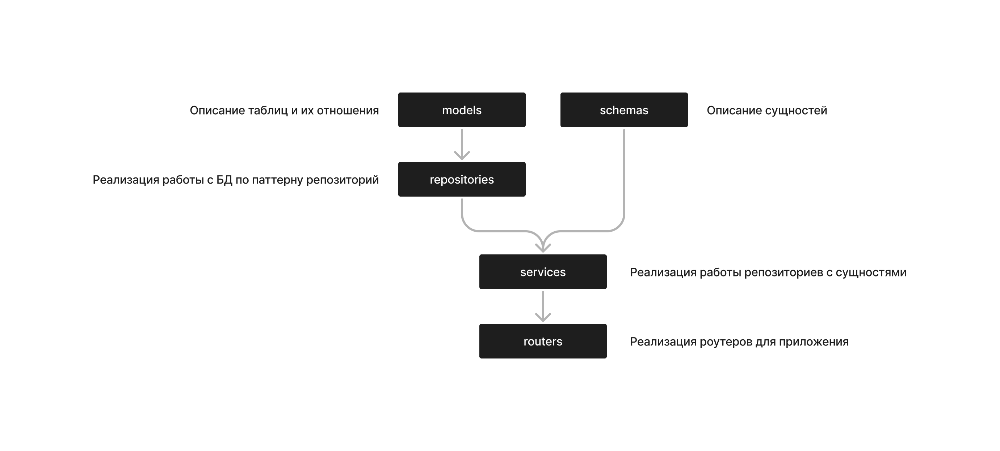

# Repository Pattern Example

## Содержание
 - [Общая информация](#общая-информация)
 - [Запуск сервиса](#запуск-сервиса)
 - [Загрузка тестовых данных](#загрузка-тестовых-данных)

## Общая информация
Это пример сервиса-репозитория на FastAPI для обращения к СУБД PostgreSQL. 
Подробнее о самом паттерне можно прочитать <a href="https://habr.com/ru/articles/248505/">здесь</a>.
А про его минусы написано <a href="https://habr.com/ru/articles/335856/">здесь</a>.

Краткая схема такого сервиса:



Предлагаемые данные для примера имеют следующую структуру:

">

## Запуск сервиса
Запускаем docker-compose
```commandline
docker-compose -f docker-compose-test.yml up -d --build --force-recreate
```

Остановка сервиса
```commandline
docker-compose -f docker-compose-test.yml down
```

Для просмотра логов пользуйтесь следующей командой
```commandline
docker-compose -f docker-compose-test.yml logs
```

Для запуска сервиса вам потребуется <b>dotenv</b> файл с системными переменными. 
Поместить его необходимо в директорию <b>app</b>

Пример такого dotenv файла (его название <b>.env</b>):
```text
DATABASE_DIALECT=postgresql+asyncpg
DATABASE_HOSTNAME=ссылка_на_кластер_postgresql
DATABASE_NAME=название_бд
DATABASE_PASSWORD=ваш_пароль
DATABASE_PORT=порт_скорее_всего_он_будет_5004
DATABASE_USERNAME=ваше_имя_пользователя
DEBUG_MODE=нужны_ли_логи_sqlalchemy
```

После запуска сервиса таблицы автоматически создадуться в бд, в схеме <b>public</b>

Сервис работает асинхронно, учитывайте это при экспериментах

## Запуск PostgreSQL

Для запуска СУБД PostgreSQL выполните следующий скрипт:
```commandline
sh scripts/run_postgres.sh
```

Для запущенной БД конфигурация для .env файла будет выглядеть следующим образом:

```
DATABASE_DIALECT=postgresql+asyncpg
DATABASE_HOSTNAME=localhost
DATABASE_NAME=demo_db
DATABASE_PASSWORD=password_123
DATABASE_PORT=5432
DATABASE_USERNAME=user_demo
DEBUG_MODE=True
```

Для подключение через DBeaver креды будут выглядеть следующий образом:
```
URL: jdbc:postgresql://localhost:5432/demo_db
LOGIN: user_demo
PASSWORD: password_123
```

## Загрузка тестовых данных

Установите все необходимые библиотеки:
```commandline
pip3 install -r scripts/requirements-migrate.txt
```

И запустите скрипт:
```commandline
python3 scripts/migrate.py
```